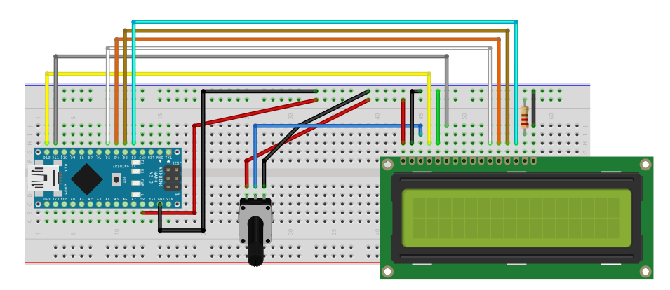

This is an example to create an LCD display program
In this program, we need :
* Arduino Nano (optional, you can use another type of Arduino)
* 16x2 LCD Display
* Jumper Wire
* Potentiometer
* 220 Ohm Resistor
* Jumper wires
* Breadboard / Protoboard

Also, don't forget to install and IDE of Arduino. This program is just a simple example of LCD usage in Arduino environment.
(optional) to open up .fzz files you need to install Frizting software.

The diagram of the device might be like this :

Enjoy your coding day :blush:

Your friend,
**Ahmad Mujahid**
